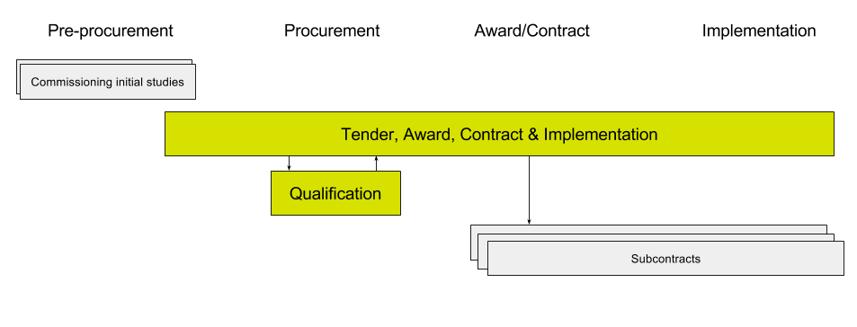

## The Contracting Process

A Public Private Partnership **project** involves a number of different stages:

* Pre-procurement
* Procurement
* Award & contract
* Implementation

At each of these project stages, a number of different contracting process might take place. For example:

* Contracting for feasability studies and preparatory reports;
* A qualification stage for potential PPP partners/suppliers/operators;
* A process to select the PPP partners/suppliers/operators;
* Sub-contracting during project delivery;
* Associated contracts for project management and oversight;



Each of these individual contracting processes have a number of stages, including their own planning, tender, award, contract and implementation. In the case of the main PPP contract award, the process and, in particular it's implementation phase, may last for many years, or even decades. 

When producing OCDS data for a PPP project, it is important to identify the **primary contracting process** against which the majority of disclosures required by the PPP Disclosure Framework will be recorded (in some cases, complex qualification processes may need be modelled using a ```relatedProcess```). 

This is the OCDS process which, when visualised, will give a clear picture of how the PPP was planned, procured and implemented. 

Alongside this, any number of **suplementary contracting process** can be represented. 

## Stages of a contracting process 

OCDS has a number of sections, capturing information on different stages of a contracting process.

<style><!--
.process-table { width:18%; float:left; font-size:10pt; }
.process-table p { font-size:10pt; text-align: center; }
.process-table img { width:80%; }
--></style>

<div style="width:100%">

<div class="process-table" markdown=1>


**Planning**<br/>
*Including:*<br/>
Budgets<br/>
Project plans<br/>
Procurement plans<br/>
Market studies<br/>
Public hearing info<br/>

</div>

<div class="process-table" markdown=1>


**Initiation (Tender)**<br/>
*Including:*<br/>
Tender notices<br/>
Specifications<br/>
Line items<br/>
Values<br/>
Enquiries

</div>

<div class="process-table" markdown=1>


**Award**<br/>
*Including:*<br/>
Details of award<br/>
Bidder information<br/>
Bid evaluation<br/>
Values

</div>

<div class="process-table" markdown=1>


**Contract**<br/>
*Including:*<br/>
Final details<br/>
Signed contract<br/>
Amendments<br/>
Values

</div>

<div class="process-table" markdown=1>


**Implementation**<br/>
*Including:*<br/>
Payments<br/>
Progress updates<br/>
Location<br/>
Extensions<br/>
Amendments<br/>
Completion or Termination info

</div>

</div>
<br clear="all"/>

Not all contracting processes have all stages. For example, direct contracting may start with the award of a contract. However, there will still be information that can be disclosed about the budgets, specifications and selection process even in this case. 

You should aim to publish OCDS data close to real-time: releasing data as each stage of a contracting process takes place.

This may involve generating output from a range of different systems. Data published from different systems can be tied together by use of a common Open Contracting ID (```ocid```).

### Defining a contracting process

For procurement OCDS defines a unique contracting process as:

> All the planning, tendering information, awards, contracts and contract implementation information related to a single initiation process.

An initiation process may be a tender, a direct contract award, or a call to award a concession. 

### The Open Contracting ID (ocid)

Each unique contracting process should be assigned an ```ocid```. This is an identifier which can be used to join up data between different stages (as often the data may be stored in different systems). 

To make sure the ```ocid```s assigned by two different publishers do not clash, publishers are encouraged to register a publisher prefix. This can be prepended onto locally generated identifiers, giving a globally unique identifier, and allowing disparate data sources to confidently refer to a unique contracting process. 

You can [register your ocid prefix here](../implementation/registration.md).

<div class="example hint" markdown=1>

<p class="first admonition-title">Worked Example</p>

In [Mexico City](http://www.contratosabiertos.cdmx.gob.mx/), an initial mapping identified that identifiers were assigned to each tender process or direct award, using a pattern based on the initials or name of the department involved, a tender or contract number, and the year. 

For example:

> OM-DGRMSG-004-13

These identifiers uniquely identify each contracting process. Fields and business processes to capture these identifiers at each contracting process stage were added to the relevant systems.

Mexico City then registered a prefix with the OCDS helpdesk. They have been given the prefix 'ocds-87sd3t' which can be added to their unique process identifiers to give a globally unique ocid. 

For example:

> ocds-87sd3t-OM-DGRMSG-004-13

All the award notices, contracts and transactions resulting from the tender with this identifier should also share this ocid - allowing Mexico City to bring together a complete picture of each contracting process.

</div>

<div class="warning" markdown=1>
    
<p class="first admonition-title">Note</p>
    
The ```ocid``` is case sensitive. Case should be used consistently whenever an ```ocid``` is presented.

</div>

### Mapping your systems

The Open Contracting Data Standard helpdesk provide [a technical assessment template](http://www.open-contracting.org/resources/ocds-technical-assessment-template/) that can be used to identify the different systems involved in managing data on each stage of the contracting process.

